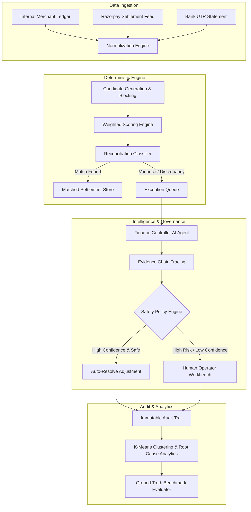
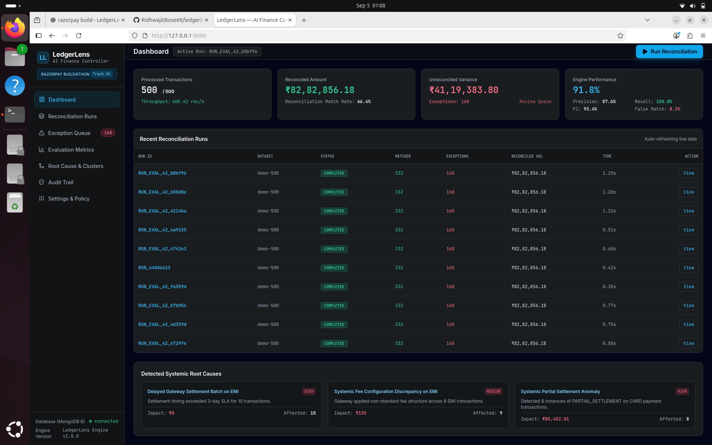
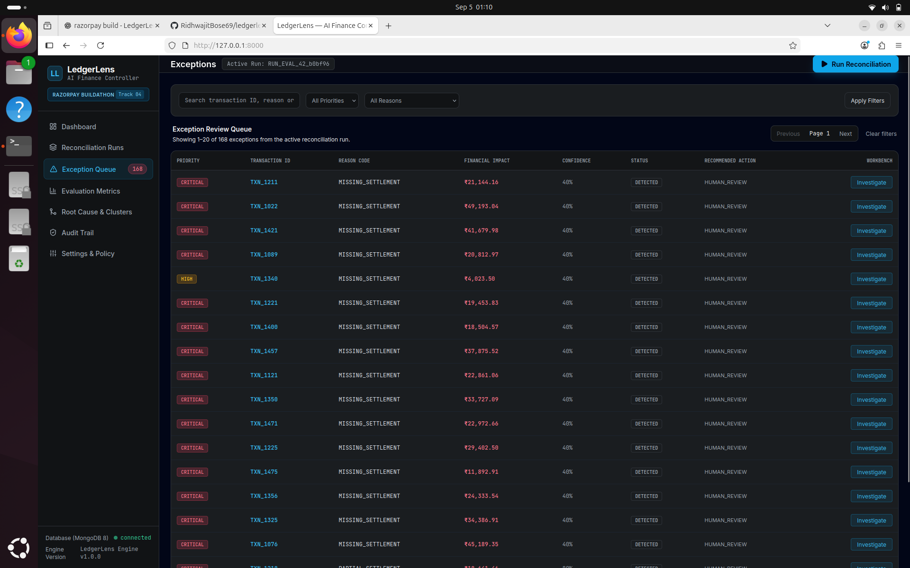
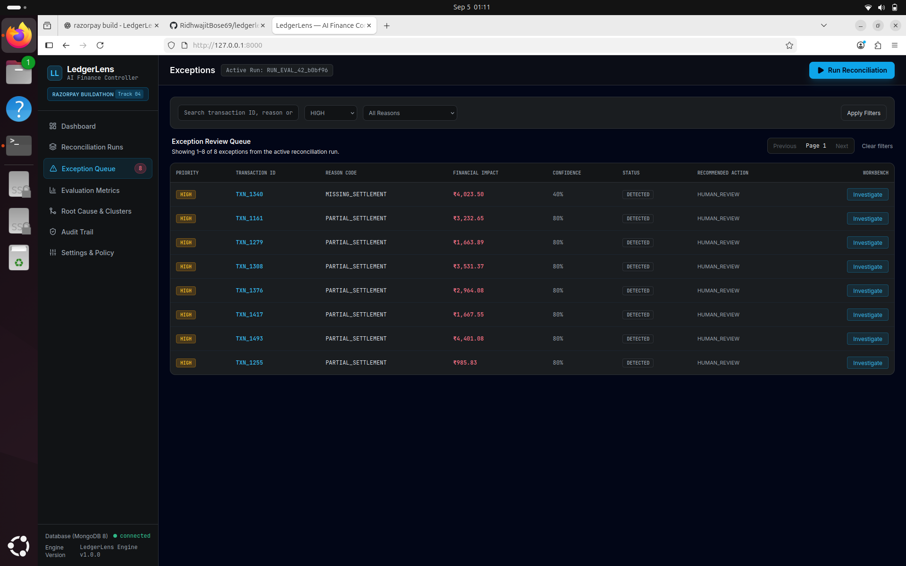
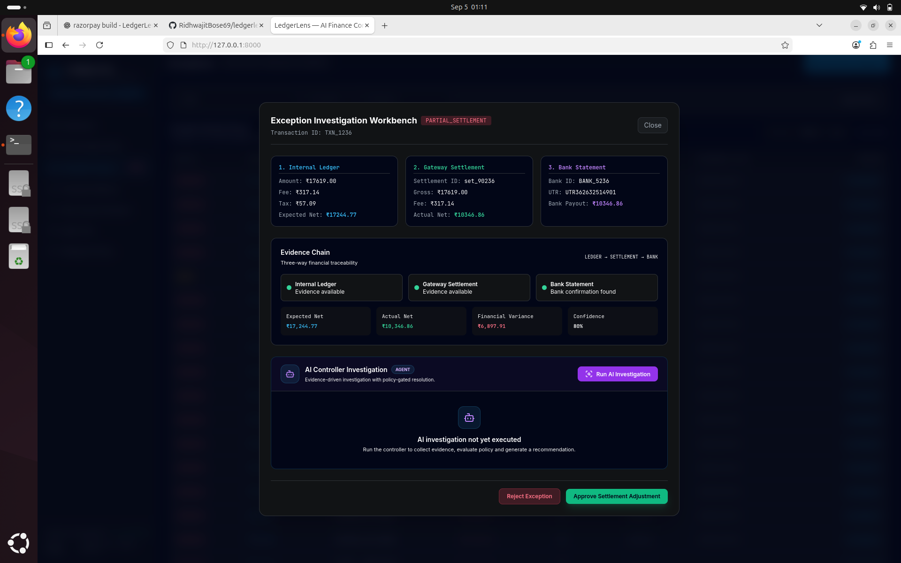
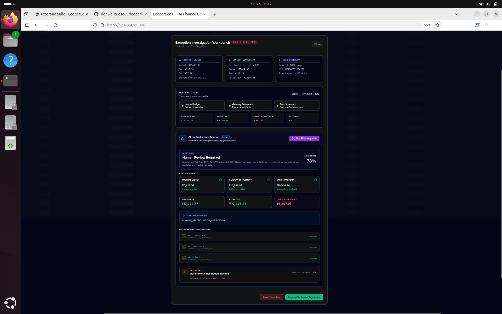
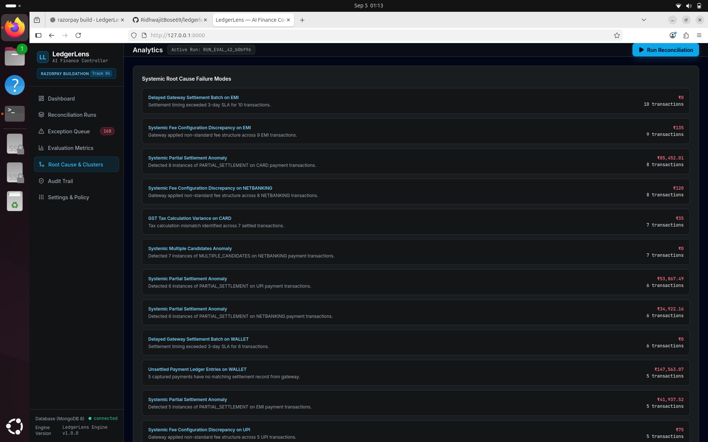
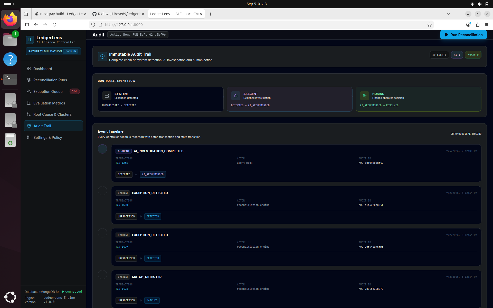

# LedgerLens — Autonomous AI Finance Controller

> **Razorpay Buildathon 2026 — Track 04: AI Finance Controller**
> *Production-Ready 3-Way Autonomous Settlement Reconciliation & Exception Governance System*

---

## 🌟 Overview

**LedgerLens** is a high-throughput, enterprise-grade AI Finance Controller designed to automate financial settlement reconciliation across internal ledgers, payment gateways (Razorpay), and banking statements.

### Key Capabilities
- **Deterministic 3-Way Engine**: Multi-stage candidate blocking, fuzzy/exact identifier scoring, and integer-based financial precision (**paise**).
- **Autonomous AI Controller**: Investigates unreconciled exceptions, performs evidence tracing, and evaluates strict financial safety policies (`AUTO_RESOLVE` vs `HUMAN_REVIEW`).
- **Ground Truth Synthetic Evaluation Engine**: Benchmark engine computing Precision, Recall, Accuracy, F1 Score, and Confusion Matrices against deterministic synthetic datasets.
- **Analytics & Root Cause Engine**: Systemic pattern detection (fee/tax variances, SLA breaches) and Scikit-Learn K-Means exception clustering.
- **Auditability**: Immutable audit trail tracking all state transitions and agent actions.
- **Production Performance**: High throughput (**900+ records/sec**) with sub-millisecond per-record reconciliation latency.

---

## 📐 Architecture Pipeline


# LedgerLens — AI Finance Controller

> **Razorpay Buildathon · Track 04 — AI Finance Controller**

**LedgerLens** is an AI-assisted finance reconciliation and exception-management system that closes a critical finance-operations loop: **reconcile transactions → detect exceptions → investigate with evidence → prioritize → route to human approval → maintain an auditable resolution trail.**

It compares internal ledger transactions against gateway settlements and bank confirmations, identifies financial discrepancies, explains why they occurred, and gives finance operators a controlled workflow for resolving exceptions.

---

## Why LedgerLens?

Financial reconciliation is often more than finding whether two numbers match.

A finance operations team may need to determine:

* Was the payment actually settled?
* Does the settlement belong to the correct transaction?
* Was the expected fee deducted?
* Is the settlement date correct?
* Is the amount partially settled?
* Is there a duplicate settlement?
* Did the bank actually confirm the movement of funds?
* Can an AI system explain the exception without making an unsafe financial decision?

LedgerLens turns this process into an **evidence-driven reconciliation workflow**.

### Core principle

> **AI investigates. Humans control financial resolution.**

LedgerLens does not blindly auto-resolve financial exceptions. Its policy engine enforces confidence and financial-impact thresholds before autonomous resolution can be considered.

---

# Product Workflow

```text
                 ┌─────────────────────┐
                 │   Internal Ledger   │
                 └──────────┬──────────┘
                            │
                            ▼
                 ┌─────────────────────┐
                 │ Reconciliation      │
                 │ Engine              │
                 └──────────┬──────────┘
                            │
             ┌──────────────┼──────────────┐
             │              │              │
             ▼              ▼              ▼
        Settlements      Bank Data     Transaction
        / Gateway                       Metadata
             │              │              │
             └──────────────┼──────────────┘
                            ▼
                 ┌─────────────────────┐
                 │ Exception Detection │
                 └──────────┬──────────┘
                            │
                            ▼
                 ┌─────────────────────┐
                 │ Priority & Root     │
                 │ Cause Analysis      │
                 └──────────┬──────────┘
                            │
                            ▼
                 ┌─────────────────────┐
                 │ AI Investigation    │
                 │ Evidence Chain      │
                 └──────────┬──────────┘
                            │
                            ▼
                 ┌─────────────────────┐
                 │ Human Approval /    │
                 │ Rejection           │
                 └──────────┬──────────┘
                            │
                            ▼
                 ┌─────────────────────┐
                 │ Immutable Audit     │
                 │ Trail               │
                 └─────────────────────┘
```

---

# Key Capabilities

## 1. Automated Reconciliation

LedgerLens compares financial records across multiple sources using strong transaction identifiers and controlled fallback matching.

Matching signals include:

* `payment_id`
* `reference_id`
* `order_id`
* `UTR`
* transaction dates
* settlement dates
* expected net amount
* actual settlement amount
* fee
* tax
* currency

The engine deliberately avoids guessing when strong identifiers contradict each other.

---

## 2. Exception Detection

LedgerLens identifies operational and financial reconciliation failures such as:

| Exception              | Meaning                                                                   |
| ---------------------- | ------------------------------------------------------------------------- |
| `MISSING_SETTLEMENT`   | Ledger transaction has no corresponding settlement                        |
| `MISSING_LEDGER`       | Settlement exists without a corresponding ledger record                   |
| `FEE_VARIANCE`         | Fee differs from the expected value                                       |
| `TAX_VARIANCE`         | Tax differs from the expected value                                       |
| `DATE_VARIANCE`        | Settlement timing differs from expected timing                            |
| `PARTIAL_SETTLEMENT`   | Only part of the expected amount was settled                              |
| `DUPLICATE`            | Multiple settlement candidates were detected                              |
| `CURRENCY_MISMATCH`    | Currency does not match the expected currency                             |
| `REFERENCE_MISMATCH`   | Transaction references do not sufficiently agree                          |
| `REVERSED_TRANSACTION` | Transaction was reversed or failed                                        |
| `UNKNOWN_TRANSACTION`  | Settlement cannot be safely confirmed through the required evidence chain |

---

# 3. AI Investigation

For complex exceptions, LedgerLens can perform an evidence-driven AI investigation.

The investigation can examine:

* internal ledger amount
* gateway settlement amount
* bank confirmation
* expected net amount
* actual net amount
* financial variance
* reconciliation reason code
* transaction metadata
* available evidence
* resolution policy

The AI produces a structured recommendation rather than directly modifying financial records.

### Example

```text
Exception
PARTIAL_SETTLEMENT

Expected Net       ₹34,386.91
Actual Settlement  ₹25,894.11
Variance            ₹8,492.80

Evidence
✓ Ledger transaction found
✓ Gateway settlement found
✓ Bank confirmation found
✓ Settlement reference matched

AI Recommendation
Investigate partial settlement and verify whether
the remaining amount is pending or belongs to
another settlement cycle.
```

---

# 4. Human-in-the-Loop Resolution

Finance operators can review an exception through the Workbench and explicitly:

* Approve
* Reject

Every human action is recorded.

LedgerLens also implements **idempotent resolution**: attempting to resolve an already terminal exception does not create duplicate resolution events.

This prevents accidental repeated financial actions.

---

# 5. Evidence Chain

Each exception provides a traceable chain connecting:

```text
Ledger
   ↓
Settlement
   ↓
Bank Confirmation
   ↓
Reconciliation Result
   ↓
AI Investigation
   ↓
Human Decision
```

This makes the system explainable and suitable for finance-operations workflows where decisions need to be reviewed later.

---

# 6. Audit Trail

LedgerLens records system, AI, and human events.

Example lifecycle:

```text
UNPROCESSED
     │
     ▼
DETECTED
     │
     ▼
AI_RECOMMENDED
     │
     ▼
APPROVED / REJECTED / RESOLVED
```

Audit events contain information such as:

* actor type
* actor ID
* action
* previous state
* new state
* timestamp
* exception ID
* run ID

The audit system also supports hash-chain verification to detect tampering with the event sequence.

---

# 7. Root Cause & Cluster Analysis

LedgerLens does not only show individual exceptions.

It aggregates failures to identify systemic patterns.

Examples:

```text
Exception Queue
       │
       ├── Fee Variance
       ├── Missing Settlement
       ├── Partial Settlement
       ├── Duplicate Settlement
       └── Currency Mismatch
                    │
                    ▼
            Root Cause Analysis
                    │
                    ▼
          Operational Clusters
```

This allows finance teams to distinguish:

**individual transaction problems**

from

**systemic reconciliation failures.**

---

# Evaluation

LedgerLens was evaluated against a synthetic ground-truth dataset containing **1,000 labelled transaction records**, with the active benchmark operating on a **500-record reconciliation batch**.

### Current benchmark

| Metric           |      Result |
| ---------------- | ----------: |
| Accuracy         |  **91.80%** |
| Precision        |  **87.65%** |
| Recall           | **100.00%** |
| F1 Score         |  **93.42%** |
| False Match Rate |   **8.20%** |

### Confusion Matrix

|                      | Predicted Match | Predicted Exception |
| -------------------- | --------------: | ------------------: |
| **Actual Match**     |             291 |                   0 |
| **Actual Exception** |              41 |                 168 |

The evaluation intentionally focuses on preventing unsafe false matches. In financial reconciliation, incorrectly declaring an exception as successfully reconciled can be more dangerous than sending a legitimate transaction for human review.

---

# Performance

Latest benchmark run:

```text
Records processed:    500
Throughput:            ~3,142 records/sec
Average latency:      ~0.15 ms
P50 latency:          ~0.12 ms
P95 latency:          ~0.19 ms
```

The reconciliation engine is designed to process batch reconciliation workloads efficiently while maintaining deterministic matching and classification rules.

---

# Architecture

```text
┌─────────────────────────────────────────────────────────────┐
│                       LedgerLens UI                         │
│                                                             │
│ Dashboard │ Runs │ Exception Queue │ Workbench │ Analytics │
│ AI Review │ Root Causes │ Audit Trail │ Settings            │
└─────────────────────────────┬───────────────────────────────┘
                              │
                              │ REST API
                              ▼
┌─────────────────────────────────────────────────────────────┐
│                       FastAPI Backend                       │
│                                                             │
│  Reconciliation │ Exceptions │ AI Agent │ Analytics         │
│  Audit Trail    │ Runs       │ Policies │ Settings          │
└──────────────┬──────────────────────┬───────────────────────┘
               │                      │
               ▼                      ▼
      ┌────────────────┐     ┌────────────────────┐
      │ Reconciliation │     │ AI Investigation   │
      │ Engine         │     │ Agent              │
      └───────┬────────┘     └─────────┬──────────┘
              │                        │
              └────────────┬───────────┘
                           ▼
                  ┌─────────────────┐
                  │    MongoDB      │
                  │                 │
                  │ Transactions    │
                  │ Settlements     │
                  │ Bank Records    │
                  │ Exceptions      │
                  │ Audit Events    │
                  │ Evaluation Runs │
                  └─────────────────┘
```

---

# Technology Stack

### Backend

* Python
* FastAPI
* Pydantic
* PyMongo
* Uvicorn
* Pytest

### Frontend

* React
* JavaScript / JSX
* Tailwind CSS
* Lucide Icons

### Data

* MongoDB
* Synthetic reconciliation datasets
* Ground-truth evaluation dataset

### AI

LedgerLens supports a provider abstraction for:

* Mock AI provider
* OpenAI
* Gemini

The default development configuration uses the **mock provider**, allowing the application to run without external AI credentials.

---

# Project Structure

```text
ledgerlens/
│
├── backend/
│   ├── app/
│   │   ├── agents/
│   │   ├── api/
│   │   ├── reconciliation/
│   │   ├── models/
│   │   ├── services/
│   │   └── main.py
│   │
│   ├── tests/
│   └── .env.example
│
├── frontend/
│   └── public/
│       ├── app.jsx
│       └── index.html
│
├── data/
│   ├── ground_truth/
│   └── generated/
│
├── docs/
│   └── evaluation/
│
├── scripts/
│   └── run_evaluation.py
│
├── .gitignore
└── README.md
```

---

# Running Locally

## Prerequisites

* Python 3.10+
* Docker
* Git

---

## 1. Clone the repository

```bash
git clone git@github.com:RidhwajitBose69/ledgerlens-ai-finance-controller.git
cd ledgerlens-ai-finance-controller
```

---

## 2. Start MongoDB

```bash
docker run -d \
  --name ledgerlens-mongodb \
  -p 27017:27017 \
  mongo:8
```

If the container already exists:

```bash
docker start ledgerlens-mongodb
```

---

## 3. Create the Python environment

```bash
python3 -m venv .venv
source .venv/bin/activate
```

Install dependencies:

```bash
pip install -r backend/requirements.txt
```

---

## 4. Configure the backend

Copy the example environment file:

```bash
cp backend/.env.example backend/.env
```

The default configuration uses the local MongoDB instance and the mock AI provider.

No external AI API key is required for the default demo configuration.

---

## 5. Start the backend

```bash
uvicorn backend.app.main:app --host 0.0.0.0 --port 8000
```

Open:

```text
http://127.0.0.1:8000
```

---

# Running the Evaluation

The evaluation script runs the reconciliation engine against the benchmark dataset and compares the predictions against ground truth.

Default:

```bash
python scripts/run_evaluation.py
```

For a specific batch size and seed:

```bash
python scripts/run_evaluation.py --records 500 --seed 42
```

The latest evaluation report is written to:

```text
docs/evaluation/latest_evaluation.json
```

---

# API

The backend exposes REST endpoints for:

* reconciliation runs
* transaction reconciliation
* exception management
* AI investigation
* human resolution
* audit trail
* analytics
* root-cause analysis
* system configuration

FastAPI's interactive API documentation is available locally at:

```text
http://127.0.0.1:8000/docs
```

---

# Safety & Resolution Policy

LedgerLens is designed around a conservative financial-control model.

The system exposes configurable controls including:

```text
Autonomous Resolution Threshold: 0.95
Maximum Auto-Resolution Amount: ₹1,00,000
```

Autonomous resolution is disabled by default in the demonstration configuration.

This creates an explicit safety boundary:

```text
                 AI
                  │
                  ▼
          Investigation
                  │
                  ▼
           Recommendation
                  │
                  ▼
          Policy / Safety Gate
                  │
          ┌───────┴───────┐
          │               │
       Blocked          Eligible
          │               │
          ▼               ▼
     Human Review    Controlled Action
```

The objective is not to maximize automation at any cost.

The objective is to **automate investigation while preserving financial control.**

---

# Example Exception

A transaction can move through the system as:

```text
TXN_1236

        ↓

PARTIAL_SETTLEMENT

        ↓

Priority: CRITICAL

        ↓

Financial Impact: ₹6,897.91

        ↓

AI Investigation

        ↓

Evidence reviewed

        ↓

Human APPROVE

        ↓

Audit event created
```

The complete lifecycle remains available to the finance operator through the Workbench and Audit Trail.

---

# Testing

The project includes automated tests covering critical resolution behavior.

Current test result:

```text
9 passed
```

Important tested behavior includes:

* exception resolution
* approval/rejection
* terminal-state handling
* idempotent resolution
* audit behavior

---

# Design Decisions

### Strong identifiers before fuzzy matching

LedgerLens prioritizes reliable identifiers such as payment IDs, references, order IDs and UTRs before considering amount/date-based fallback matching.

This reduces the risk of incorrectly associating two financially similar transactions.

### Bank confirmation as an evidence requirement

A settlement match alone is not treated as sufficient confirmation of the financial movement.

Where required bank-side evidence is absent, LedgerLens can classify the transaction as:

```text
UNKNOWN_TRANSACTION
```

rather than incorrectly declaring it reconciled.

### Human control over financial resolution

AI recommendations are separated from final human resolution.

This allows finance operators to inspect the evidence before approving a potentially material exception.

---

# Security & Configuration

Secrets are intentionally excluded from version control.

The repository ignores:

```text
.env
*.env
```

while providing:

```text
.env.example
```

for configuration templates.

API credentials for OpenAI, Gemini, Razorpay and other services should be supplied through environment variables and never committed to Git.

---

# Current Status

**Status: Submission Ready**

Implemented and verified:

* [x] Automated reconciliation engine
* [x] Multi-source transaction matching
* [x] Exception classification
* [x] Exception prioritization
* [x] Reconciliation runs
* [x] Evaluation benchmark
* [x] AI investigation
* [x] Evidence chain
* [x] Human approval/rejection
* [x] Idempotent resolution
* [x] Audit trail
* [x] Audit hash-chain verification
* [x] Root-cause analytics
* [x] Exception clustering
* [x] Dashboard
* [x] Settings and policy controls
* [x] Automated tests
* [x] Production-safe React icon lifecycle handling

---

# Future Improvements

Potential next steps include:

* streaming reconciliation for continuously arriving transactions
* real Razorpay settlement integration
* real bank-feed integrations
* richer anomaly detection
* learned transaction matching models
* human feedback loops for improving AI recommendations
* role-based access control
* enterprise authentication
* distributed reconciliation workers
* production observability and alerting

---

# Buildathon Context

LedgerLens was built for the **Razorpay Buildathon** as an implementation of an AI Finance Controller capable of closing a finance-operations loop over a large synthetic transaction batch.

The project focuses on the practical intersection of:

**Financial reconciliation + AI investigation + human oversight + auditability.**

Rather than treating AI as a black-box financial decision maker, LedgerLens uses AI where it is most useful:

> **understanding evidence, explaining exceptions, and helping finance operators make faster decisions.**

---

## Author

**Ridhwajit Bose**

B.Tech — Computer Science & Engineering (Artificial Intelligence)

Amrita School of Computing, Amritapuri

---

## License

This project was developed as a buildathon submission and demonstration project.
---

# Product Screenshots

LedgerLens provides a complete finance-operations workspace for reconciliation, exception investigation, AI-assisted analysis, and controlled human resolution.

## Dashboard

The operational dashboard provides an overview of the active reconciliation run, processing performance, reconciled amount, unresolved variance, and review queue.



## Exception Queue

The exception queue prioritizes reconciliation failures by severity and financial impact, allowing finance teams to focus on the most important issues first.



## Priority Filtering

Finance operators can filter the queue by priority and investigate high-impact exceptions without navigating through the entire batch.



## Exception Workbench

The Workbench brings together the internal ledger, gateway settlement, bank statement, evidence chain, financial variance, and resolution controls.



## AI Investigation

LedgerLens performs evidence-driven AI investigations and generates recommendations while keeping final financial resolution under human control.



## Root Cause & Clusters

Root-cause analytics aggregate individual reconciliation failures into systemic patterns, helping finance teams identify recurring operational problems.



## Immutable Audit Trail

System detection, AI investigation, and human decisions are recorded as a traceable event lifecycle.


