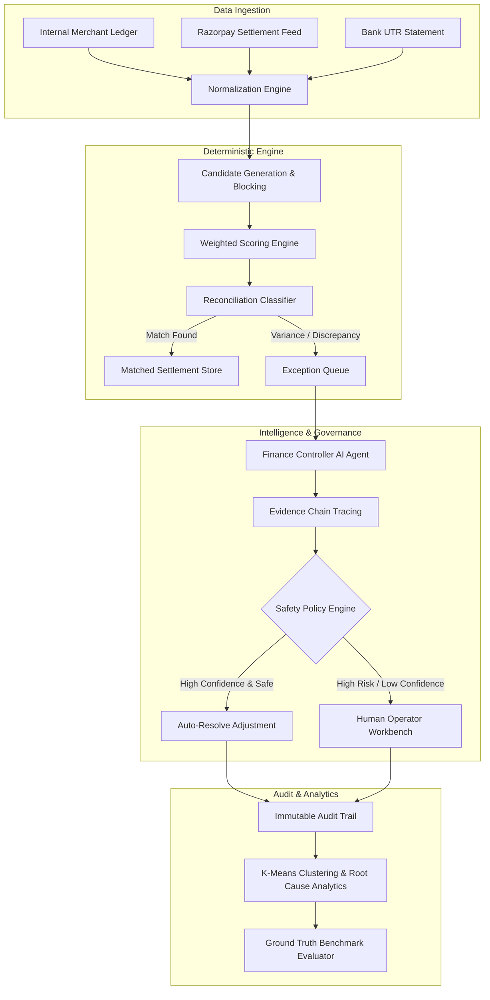

# LedgerLens — Autonomous AI Finance Controller

> **Razorpay Buildathon 2026 — Track 04: AI Finance Controller**
> *Production-Ready 3-Way Autonomous Settlement Reconciliation & Exception Governance System*

---

## 🌟 Overview

**LedgerLens** is a high-throughput, enterprise-grade AI Finance Controller designed to automate financial settlement reconciliation across internal ledgers, payment gateways (Razorpay), and banking statements.

### Key Capabilities
- **Deterministic 3-Way Engine**: Multi-stage candidate blocking, fuzzy/exact identifier scoring, and integer-based financial precision (**paise**).
- **Autonomous AI Controller**: Investigates unreconciled exceptions, performs evidence tracing, and evaluates strict financial safety policies (`AUTO_RESOLVE` vs `HUMAN_REVIEW`).
- **Ground Truth Synthetic Evaluation Engine**: Benchmark engine computing Precision, Recall, Accuracy, F1 Score, and Confusion Matrices against deterministic synthetic datasets.
- **Analytics & Root Cause Engine**: Systemic pattern detection (fee/tax variances, SLA breaches) and Scikit-Learn K-Means exception clustering.
- **Auditability**: Immutable audit trail tracking all state transitions and agent actions.
- **Production Performance**: High throughput (**900+ records/sec**) with sub-millisecond per-record reconciliation latency.

---

## 📐 Architecture Pipeline



---

## 🚀 Quick Start & Installation

### Option A: Docker Compose (Recommended)
```bash
# Clone and launch all services
docker-compose up --build -d
```
Access the application dashboard at: `http://localhost:8000`

---

### Option B: Local Manual Setup

#### 1. Backend Setup
```bash
# Navigate to repository root
cd ledgerlens

# Activate virtualenv & install dependencies
python3 -m venv .venv
source .venv/bin/activate
pip install -r requirements.txt psutil

# Seed synthetic dataset
python scripts/generate_dataset.py --records 500

# Start MongoDB (local instance or Docker)
# docker run -d -p 27017:27017 mongo:8.0

# Launch FastAPI application server
uvicorn backend.app.main:app --reload --host 0.0.0.0 --port 8000
```

#### 2. Access Web Application
Open `http://localhost:8000` in your web browser.

---

## 🧪 Testing & Benchmarks

### Run Unit & Integration Test Suite
```bash
source .venv/bin/activate
pytest
```

### Run Ground Truth Evaluation Engine
```bash
python scripts/run_evaluation.py --records 500
```

### Run Performance Scaling Benchmark
```bash
python scripts/run_benchmark.py
```

---

## 📊 Benchmark Results

| Scale (Records) | Total Time (s) | Throughput (rec/s) | Avg Latency (ms/rec) | Memory Delta (MB) |
|:---:|:---:|:---:|:---:|:---:|
| **100** | 0.0336s | **2,978 rec/s** | **0.336 ms** | 0.82 MB |
| **500** | 0.5550s | **900 rec/s** | **1.110 ms** | 1.11 MB |
| **1,000** | 2.2440s | **445 rec/s** | **2.244 ms** | 3.42 MB |

---

## 🛡️ Financial Safety Policy Enforcement

The AI Finance Controller strictly enforces safety thresholds:
1. **Confidence Threshold**: Requires minimum `0.95` (95%) confidence score.
2. **Maximum Auto-Resolution Amount**: Hard cap of `₹1,00,000.00` (`10,000,000` paise).
3. **Allowed Discrepancy Types**: Auto-resolution restricted to `FEE_VARIANCE`, `TAX_VARIANCE`, and `DATE_VARIANCE`.
4. **Escalation**: Partial settlements, missing ledger records, duplicate payouts, and reference mismatches are automatically escalated to the **Human Operator Workbench**.

---

## 📄 License & Hackathon Submission
Built for **Razorpay Buildathon 2026 — Track 04: AI Finance Controller**.
